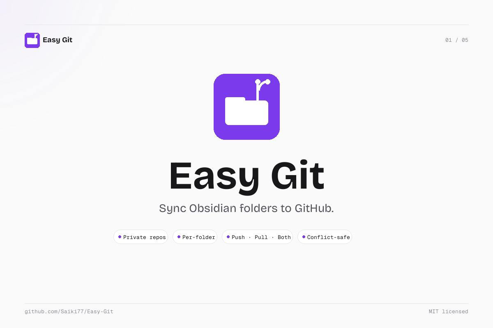
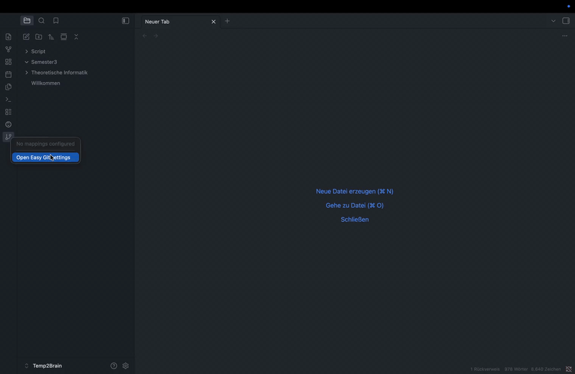
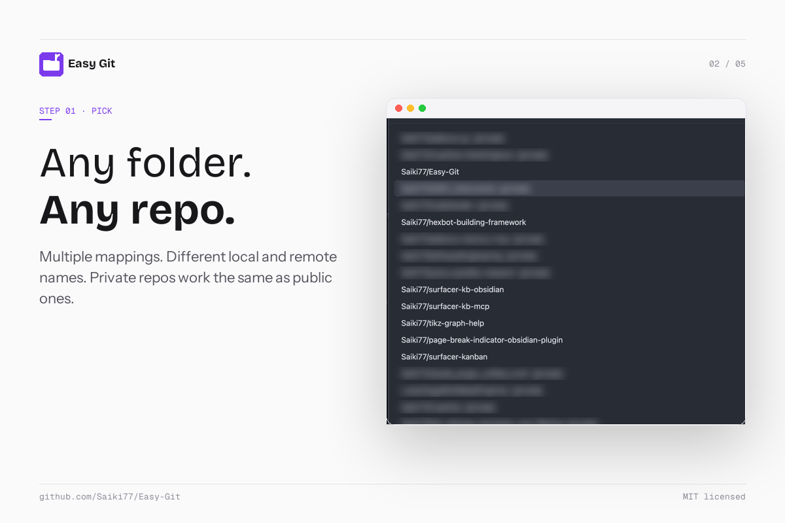
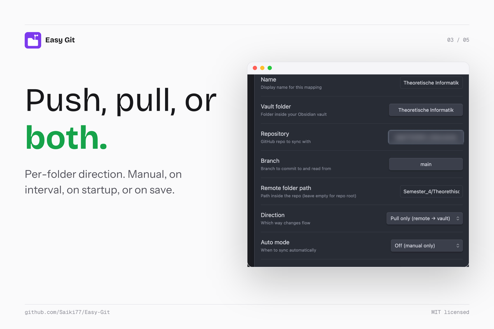
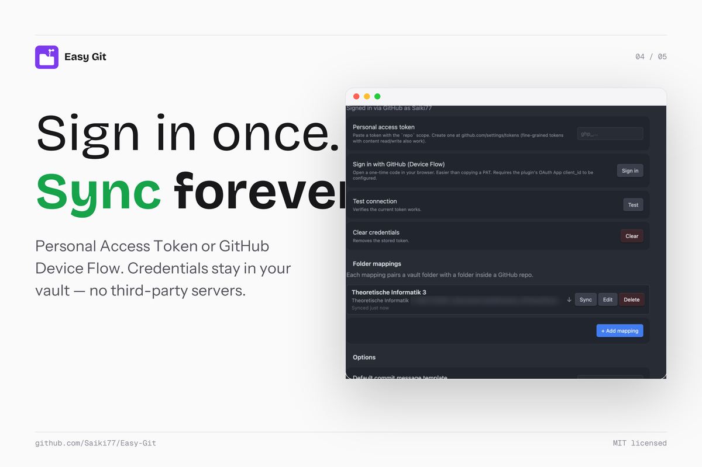
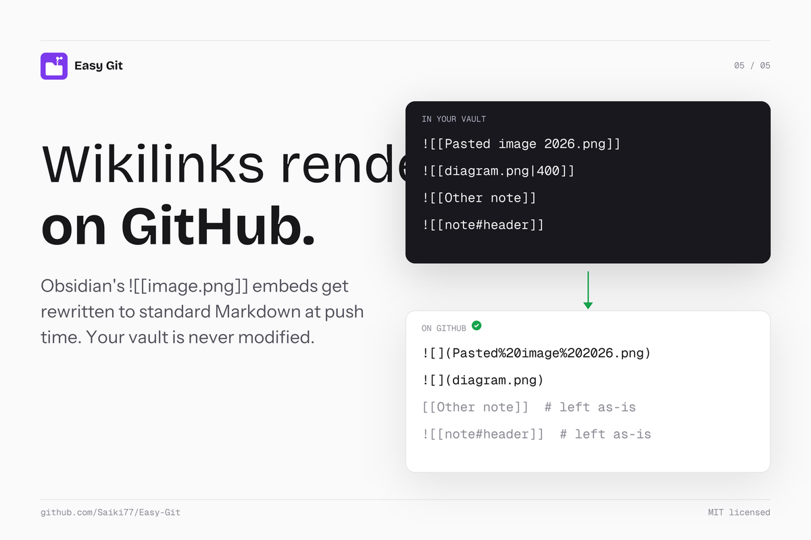

<p align="center">
  
</p>

<p align="center">
  
</p>
<p align="center"><sub>End-to-end: open Settings, add a mapping, pick the repo, save, sync. <a href="docs/screenshots/demo.mp4">(MP4)</a></sub></p>

<table>
  <tr>
    <td width="50%"></td>
    <td width="50%"></td>
  </tr>
  <tr>
    <td width="50%"></td>
    <td width="50%"></td>
  </tr>
</table>

## Why

Obsidian's built-in Sync covers your whole vault. Easy Git is for the case where you want to share only one or two folders with a repo: a notes folder you keep public, course material you collaborate on, a snippets section you want backed up under version control. You pick the folder, you pick the repo, you pick the direction. That's it.

## Install

**Via BRAT** (recommended while the community-plugin submission is in review)

1. Install the [BRAT](https://github.com/TfTHacker/obsidian42-brat) plugin.
2. BRAT settings → **Add Beta Plugin** → paste `Saiki77/Easy-Git`.
3. Enable **Easy Git** under Settings → Community plugins.

**Manual:** download `main.js`, `manifest.json`, `styles.css` from the [latest release](../../releases) into `<your vault>/.obsidian/plugins/easy-git/`.

## Sign in

Either works for private repos.

- **Personal Access Token.** Create one at [github.com/settings/tokens](https://github.com/settings/tokens) with the `repo` scope (or a fine-grained token with `Contents: Read and write` + `Metadata: Read`), paste it in settings, hit **Test connection**.
- **Sign in with GitHub.** Click the button, enter the one-time code on github.com, the plugin picks up the token automatically.

## Add a folder mapping

Settings → Easy Git → **+ Add mapping**. Pick the vault folder (or the vault root for whole-vault sync), add one or more destinations (each = repo + branch + path inside the repo), the direction (push only, pull only, or both), and how often to sync (manual, on interval, on startup, or on save). Save.

If you rename or move the mapping's folder inside Obsidian later, Easy Git updates the mapping path automatically and shows a Notice. If the folder is missing entirely (deleted, or moved while Obsidian was closed), the next sync aborts with a clear error instead of interpreting the missing folder as "delete everything on the remote."

After that, sync from the ribbon menu, the command palette (`Easy Git: Sync mapping…`), or the **Sync** button next to each mapping.

## Multiple destinations per mapping

A single mapping can push the same vault folder to several places at once. Two patterns this unlocks:

**Mirror to several repos**

```
Vault                                   Remote
─────                                   ──────
Notes/blog ──┬──> public-blog/main/posts/
             └──> backup/main/blog-mirror/
```

Useful for keeping a public-facing copy and a private backup in sync from one source.

**Fan out to several folders of one repo** (e.g. a static site)

```
Vault                                   Remote (one repo)
─────                                   ──────
Notes/blog     ──> site/main/src/content/blog/
Notes/projects ──> site/main/src/content/projects/
Notes/about    ──> site/main/src/about/
```

Each of those is a separate mapping with one destination, but the multi-destination feature means a single mapping like `Notes` can fan out to two subfolders of the same site repo if that fits your layout better.

**How it behaves**

- Destinations sync **sequentially**, each producing its own atomic commit. Order is the order shown in the modal.
- Each destination tracks **its own last-sync state**, so a hiccup with one remote doesn't poison the others. If destination 1 errors, destination 2 still tries.
- The conflict modal shows the destination label in its title when a mapping has more than one destination, so it's clear which target the conflict is for.
- Per-mapping settings (direction, auto mode, commit template, wikilink rewrite) apply to every destination of that mapping. Pick "push" once and all destinations are push-only.

**Adding or removing a destination**

In the mapping modal, scroll to **Destinations** and click **+ Add destination** for another row, or **Remove** on an existing one. Each row needs a repo and a branch; the path inside the repo can be empty (= repo root). Save when done.

## Wikilinks and attachments

Obsidian uses wikilink embeds like `![[Pasted image …png]]`. GitHub's Markdown renderer doesn't understand them, so they'd show as literal text. Easy Git rewrites them to standard CommonMark at push time:

| In your vault | What lands on GitHub |
| --- | --- |
| `![[image.png]]` | `` |
| `![[image.png\|Caption]]` | `` |
| `![[image.png\|400]]` | `` (width hint dropped) |
| `![[note#header]]` | unchanged (GitHub can't transclude) |

If a wikilink points to an attachment outside the mapping's vault folder, the file is copied to `attachments/<basename>` inside the mapping's remote folder and the rewritten link points there. That keeps each remote folder self-contained, you can browse it on GitHub without broken references.

Your vault is never modified. The rewrite only affects the bytes pushed to GitHub. Pulling those notes back into Obsidian renders fine because both wikilink and standard-Markdown forms work in Obsidian.

Toggle off per mapping if you want the raw wikilinks pushed verbatim (the mapping summary will show `(raw wikilinks)`).

## Conflicts

If the same file changed on both sides since the last sync, Easy Git pauses and lets you pick **keep local**, **keep remote**, or **keep both** (renames your local copy with a `-conflict-local-<timestamp>` suffix so neither side is lost). Cancelling the conflict modal aborts the entire run without touching anything.

## How sync works under the hood

Each run produces one atomic commit via GitHub's Git Data API: blob → tree (with `base_tree` so unrelated files in the repo are preserved) → commit → ref update. The branch's current HEAD is fetched right before the commit is built, and the ref update is non-fast-forward-protected, so if someone else pushes mid-run the sync retries from scratch (up to 3×, 1s/3s/9s backoff) instead of clobbering.

File identity is the git blob SHA-1 (matches `git hash-object`), so we compare local and remote without round-tripping content.

For a step-by-step walkthrough of one sync run, the three-way classifier, the conflict-resolution choices, the wikilink rewriter, and the OAuth Device Flow, see [docs/how-it-works.md](docs/how-it-works.md).

## Defaults

- Excluded: `.obsidian/**`, `.trash/**`, `.git/**`, `node_modules/**` (editable in settings).
- Files over 95 MB are skipped (GitHub's blob limit is 100 MB).
- Authenticated rate limit headroom is checked before each run.
- Mobile compatible: no shell access, no node-only modules.

## Per-mapping `.easygitignore`

Drop a `.easygitignore` file at the root of any mapping's vault folder and its patterns are added on top of the global excludes for that mapping only. Same syntax as the global list: one glob per line, `#` for comments, blank lines ignored. Useful when you want to exclude `*.pdf` in one mapping but not another. The `.easygitignore` file itself is never pushed.

## Status bar

A small indicator sits in Obsidian's bottom-right status bar showing the aggregate sync state across all mappings:

- `↻ Ready` — at least one mapping configured, nothing has synced yet
- `↻ Synced 5m ago` — last successful sync (most recent across mappings)
- `↻ Syncing…` — a sync is in progress
- `! Easy Git error` — at least one mapping has an unresolved error

Click it to jump straight to Easy Git's settings. Hidden when you have no mappings configured.

## Permissions

- **Clipboard**: written to only by the **Sign in with GitHub** button, which copies the one-time device code so you can paste it on github.com. No clipboard reads anywhere.
- **Network**: every HTTP call goes to `api.github.com` (and `github.com/login/...` for Device Flow). No third-party servers.
- **Vault**: reads and writes only inside the folders you configure as mappings, minus your exclusion globs.

## Build from source

```sh
npm install
npm run build
```

`main.js` is the bundled output. The release workflow at `.github/workflows/release.yml` builds and uploads `main.js` + `manifest.json` + `styles.css` on tag push.

## License

[MIT](./LICENSE)
